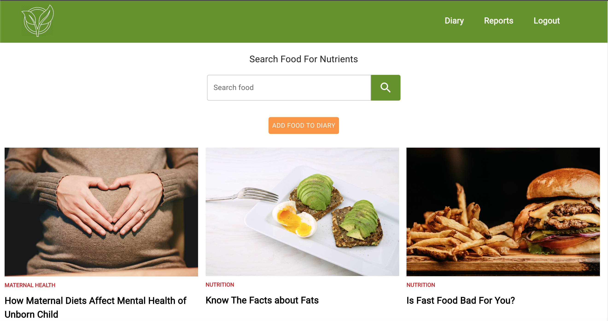

# Nutrition Tracker Application

An online web application where users can search food for nutrition values, add food to their diaries and keep track of bad nutrition intake daily - developed using React, Node.js, Express.js and MongoDB.



### [Live Demo](https://nutrient--tracker.herokuapp.com/) 

#### What you need to run this code
1. Node (14.x)
2. NPM (6.x)
3. MongoDB (4.x)

####  How to run this code
1. Make sure MongoDB is running on your system.
2. Clone this repository.
3. Open command line in the cloned folder
  - To install dependencies, run ``` npm install ```
  - To run the application for development, run ``` npm run development ```
4. Open [localhost:3000](http://localhost:3000/) in the browser
---
